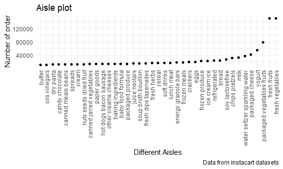
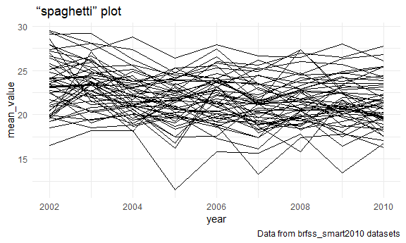
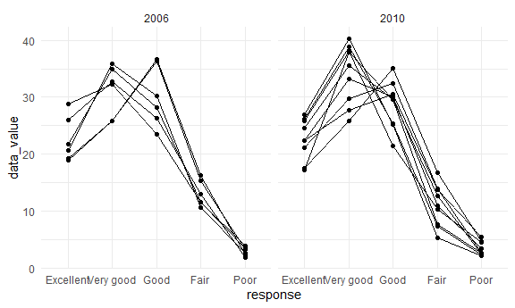
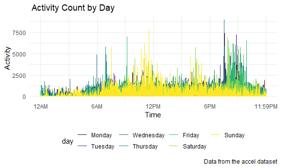

p8105\_hw3\_hs3239
================
hanfu shi
2021/10/14

\#Setting

``` r
library(tidyverse)
```

    ## -- Attaching packages --------------------------------------- tidyverse 1.3.1 --

    ## v ggplot2 3.3.5     v purrr   0.3.4
    ## v tibble  3.1.4     v dplyr   1.0.7
    ## v tidyr   1.1.3     v stringr 1.4.0
    ## v readr   2.0.1     v forcats 0.5.1

    ## -- Conflicts ------------------------------------------ tidyverse_conflicts() --
    ## x dplyr::filter() masks stats::filter()
    ## x dplyr::lag()    masks stats::lag()

``` r
library(readxl)
library(devtools)
```

    ## 载入需要的程辑包：usethis

``` r
library(dplyr)
library(ggplot2)
library(patchwork)
library(ggridges)
knitr::opts_chunk$set(
  fig.width = 6,
  fig.asp = 0.6,
  out.width = "90%"
)
theme_set(theme_minimal() + theme(legend.position = "bottom"))
options(
  ggplot2.continuous.colour = "viridis",
  ggplot2.continuous.fill = "viridis"
)
scale_colour_discrete = scale_color_viridis_d
scale_fill_discrete = scale_fill_viridis_d
```

Problem 1

``` r
#find the distinct id numbers
instacart_aisles = select(instacart, order_number,aisle_id)
id_number= count(instacart_aisles,aisle_id)
```

The dataset contains1384617 rows and 15 columns(variables) Observations
are the level of items in order by user. The key variables are Aisles,
Aisles’s ID and order ID. There are134 aisles and fresh vegetables are
the most item ordered.

The plot that shows the number of items ordered in each aisle, limiting
this to aisles with more than 10000 items ordered

``` r
#P1 plot
instacart %>% 
  count(aisle) %>% 
  filter(n > 10000) %>% 
  mutate(
    aisle = factor(aisle),
    aisle = fct_reorder(aisle, n)
  ) %>% 
  ggplot(aes(x = aisle, y = n)) +
  geom_point()+
theme(axis.text.x = element_text(angle = 90, vjust = 0.5, hjust = 1))+
  labs(title = "Aisle plot",
       x =  "Different Aisles",
       y = "Number of order",
       caption = "Data from instacart datasets")
```



The table shows the three most popular items in each of the aisles
“baking ingredients”, “dog food care”, and “packaged vegetables fruits”.

``` r
#p1 table1
instacart %>% 
  filter(aisle %in% c("baking ingredients", "dog food care", "packaged vegetables fruits")) %>% 
  group_by(aisle) %>% 
  count(product_name) %>% 
  mutate(rank = min_rank(desc(n))) %>% 
  filter(rank <=3) %>% 
  arrange(aisle, rank) %>% 
  knitr::kable()
```

| aisle                      | product\_name                                 |    n | rank |
|:---------------------------|:----------------------------------------------|-----:|-----:|
| baking ingredients         | Light Brown Sugar                             |  499 |    1 |
| baking ingredients         | Pure Baking Soda                              |  387 |    2 |
| baking ingredients         | Cane Sugar                                    |  336 |    3 |
| dog food care              | Snack Sticks Chicken & Rice Recipe Dog Treats |   30 |    1 |
| dog food care              | Organix Chicken & Brown Rice Recipe           |   28 |    2 |
| dog food care              | Small Dog Biscuits                            |   26 |    3 |
| packaged vegetables fruits | Organic Baby Spinach                          | 9784 |    1 |
| packaged vegetables fruits | Organic Raspberries                           | 5546 |    2 |
| packaged vegetables fruits | Organic Blueberries                           | 4966 |    3 |

The table shows the mean hour of the day at which Pink Lady Apples and
Coffee Ice Cream are ordered on each day of the week

``` r
#p1 table2
instacart %>% 
  filter(product_name %in% c("Pink Lady Apples", "Coffee Ice Cream")) %>% 
  group_by(product_name, order_dow) %>% 
  summarise(mean_hour = mean(order_hour_of_day)) %>% 
  pivot_wider(
    names_from = order_dow,
    values_from = mean_hour
  )%>%
  knitr::kable()
```

    ## `summarise()` has grouped output by 'product_name'. You can override using the `.groups` argument.

| product\_name    |        0 |        1 |        2 |        3 |        4 |        5 |        6 |
|:-----------------|---------:|---------:|---------:|---------:|---------:|---------:|---------:|
| Coffee Ice Cream | 13.77419 | 14.31579 | 15.38095 | 15.31818 | 15.21739 | 12.26316 | 13.83333 |
| Pink Lady Apples | 13.44118 | 11.36000 | 11.70213 | 14.25000 | 11.55172 | 12.78431 | 11.93750 |

Problem2

``` r
# load the data
library(p8105.datasets)
brfss_smart2010=p8105.datasets::brfss_smart2010
```

import and clean the data: give appropriate names, keep “Overall Health”
topic, include only responses from “Excellent” to “Poor”, and give
orders to response

``` r
brfss_df=
brfss_smart2010%>% 
    janitor::clean_names()%>%
 filter(topic == "Overall Health") %>%
    separate(locationdesc, into = c('state', 'location'), sep = ' - ') %>%
    mutate(response = as.factor(response)) %>%
    filter(response == "Excellent"  | response == "Very good" |          response == "Good" | response == "Fair" | response == "Poor") 
```

    ## Warning in FUN(X[[i]], ...): strings not representable in native encoding will
    ## be translated to UTF-8

    ## Warning in FUN(X[[i]], ...): unable to translate '<U+00C4>' to native encoding

    ## Warning in FUN(X[[i]], ...): unable to translate '<U+00D6>' to native encoding

    ## Warning in FUN(X[[i]], ...): unable to translate '<U+00E4>' to native encoding

    ## Warning in FUN(X[[i]], ...): unable to translate '<U+00F6>' to native encoding

    ## Warning in FUN(X[[i]], ...): unable to translate '<U+00DF>' to native encoding

    ## Warning in FUN(X[[i]], ...): unable to translate '<U+00C6>' to native encoding

    ## Warning in FUN(X[[i]], ...): unable to translate '<U+00E6>' to native encoding

    ## Warning in FUN(X[[i]], ...): unable to translate '<U+00D8>' to native encoding

    ## Warning in FUN(X[[i]], ...): unable to translate '<U+00F8>' to native encoding

    ## Warning in FUN(X[[i]], ...): unable to translate '<U+00C5>' to native encoding

    ## Warning in FUN(X[[i]], ...): unable to translate '<U+00E5>' to native encoding

``` r
#assign 5 levels to response variables
brfss_df$response= factor(brfss_df$response,
  levels <- (c("Excellent","Very good", "Good", "Fair", "Poor")))
```

``` r
brfss_df_location = filter(brfss_df, year == "2002")%>%
  group_by(state)%>%
  distinct(location)%>%
  summarise(n = n())%>% 
  filter(n >=7)
```

In 2002, CT FL MA NC NJ PA observed at 7 or more locations

``` r
brfss_df_location_2010 = filter(brfss_df, year == "2010")%>%
  group_by(state)%>%
  distinct(location)%>%
  summarise(n = n())%>% 
  filter(n >=7)
```

In 2002, CO PA SC OH MA NY NE WA CA MD NC TX NJ FL were observed at 7 or
more locations

Keep excellent response and make a plot showing a line for each state
across years

``` r
brfss_excellent =filter(brfss_df, response == "Excellent")%>% 
  select(year, state,data_value)%>%
  group_by(state,year)%>%
  mutate(
    value_mean = mean(data_value, na.rm = TRUE)
  )%>%
  select(-data_value)
 
  
 
  
  ggplot(brfss_excellent,aes(x = year, y = value_mean, group=state)) +
 geom_line()+


  labs(title = " “spaghetti” plot  ",
       x =  "year",
       y = "mean_value",
       caption = "Data from brfss_smart2010 datasets")
```



Make a two- panel plot showing, for the years 2006, and 2010,
distribution of data\_value for responses (“Poor” to “Excellent”) among
locations in NY State

``` r
brr=
brfss_df%>%

  filter( year == 2006 | year== 2010 )%>%
    filter(state =="NY")%>%
  drop_na(response)%>%
  group_by(location)
  
    ggplot(brr, aes(x = response, y = data_value,group=location))+
      geom_point()+
      geom_line()+
     facet_grid(. ~ year) 
```



P3 load data and include all originally observed variables and values;
have useful variable names; include a weekday vs weekend variable; and
encode data with reasonable variable classes.

``` r
accel_df = 
  read_csv("./data/accel_data.csv", col_types = cols(
      week = col_integer(),
      day_id = col_integer()
      )) %>%
  janitor::clean_names() %>% 
  mutate(
    weekend = case_when(
      day == "Monday" ~ "weekday",
      day == "Tuesday" ~ "weekday",
      day == "Wednesday" ~ "weekday",
      day == "Thursday" ~ "weekday",
      day == "Friday" ~ "weekday",
      day == "Saturday" ~ "weekend",
      day == "Sunday" ~ "weekend"
)) %>% 
  relocate("weekend") %>%
  pivot_longer(
    activity_1:activity_1440, 
    names_to = "activity",
    values_to = "activity_count") %>% 
  separate(activity, into = c("activity", "activity_minute")) %>%
  select(-activity) %>%
  mutate(
    activity_minute = as.numeric(activity_minute),
    day = factor(day),
    day = fct_relevel(day, c("Monday", "Tuesday", "Wednesday", "Thursday", "Friday", "Saturday", "Sunday"))
    )
```

The resulting dataset accel\_df contains 50400 observations and 6
variables and contains 5 weeks of activity. The data set row is divided
by weekend and weekday *day\_id* is a variable and indicates the day the
accelerometer data was collected.

*day* is a variable that was created in order to make the original
`day_id` variable easier to understand.

*week* is a variable and indicates the week the accelerometer data was
collected.

*weekend* is a variable that indicates whether the information was
collected on a weekend vs. a weekday.

*activity\_minute* is a variable that indicates the minute when the
activity count was collected, corresponding to each minute of a 24-hour
day starting at midnight.

Aggregate accross minutes to create a total activity variable for each
day, and create a table showing these totals

``` r
accel_df %>% 
  group_by(day_id, day, week) %>%
  summarize(total_activity = sum(activity_count)) %>% 
   arrange(day)%>%
  knitr::kable()
```

    ## `summarise()` has grouped output by 'day_id', 'day'. You can override using the `.groups` argument.

| day\_id | day       | week | total\_activity |
|--------:|:----------|-----:|----------------:|
|       2 | Monday    |    1 |        78828.07 |
|       9 | Monday    |    2 |       295431.00 |
|      16 | Monday    |    3 |       685910.00 |
|      23 | Monday    |    4 |       409450.00 |
|      30 | Monday    |    5 |       389080.00 |
|       6 | Tuesday   |    1 |       307094.24 |
|      13 | Tuesday   |    2 |       423245.00 |
|      20 | Tuesday   |    3 |       381507.00 |
|      27 | Tuesday   |    4 |       319568.00 |
|      34 | Tuesday   |    5 |       367824.00 |
|       7 | Wednesday |    1 |       340115.01 |
|      14 | Wednesday |    2 |       440962.00 |
|      21 | Wednesday |    3 |       468869.00 |
|      28 | Wednesday |    4 |       434460.00 |
|      35 | Wednesday |    5 |       445366.00 |
|       5 | Thursday  |    1 |       355923.64 |
|      12 | Thursday  |    2 |       474048.00 |
|      19 | Thursday  |    3 |       371230.00 |
|      26 | Thursday  |    4 |       340291.00 |
|      33 | Thursday  |    5 |       549658.00 |
|       1 | Friday    |    1 |       480542.62 |
|       8 | Friday    |    2 |       568839.00 |
|      15 | Friday    |    3 |       467420.00 |
|      22 | Friday    |    4 |       154049.00 |
|      29 | Friday    |    5 |       620860.00 |
|       3 | Saturday  |    1 |       376254.00 |
|      10 | Saturday  |    2 |       607175.00 |
|      17 | Saturday  |    3 |       382928.00 |
|      24 | Saturday  |    4 |         1440.00 |
|      31 | Saturday  |    5 |         1440.00 |
|       4 | Sunday    |    1 |       631105.00 |
|      11 | Sunday    |    2 |       422018.00 |
|      18 | Sunday    |    3 |       467052.00 |
|      25 | Sunday    |    4 |       260617.00 |
|      32 | Sunday    |    5 |       138421.00 |

The totaly activity on saturday in week 4 and 5 are less than other days

Make a single-panel plot that shows the 24-hour activity time courses
for each day and use color to indicate day of the week

``` r
accel_df %>% 
  ggplot(aes(x = activity_minute, y = activity_count, color = day)) + 
  geom_line() +
  labs(
    title = " Activity Count by Day",
    x = "Time",
    y = "Activity",
    caption = "Data from the accel dataset"
  ) + 
  scale_x_continuous(
    breaks = c(0, 360, 720, 1080, 1440), 
    labels = c("12AM", "6AM", "12PM", "6PM", "11:59PM"),
    limits = c(0, 1440)
    )
```


Conclusion:The totaly activity on the afternoon is more than other time
of period
